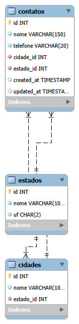

# Agenda de Contatos

Agenda de contatos desenvolvida em PHP puro e MySQL. O projeto comecou como um CRUD simples e foi evoluindo aos poucos para praticar autenticacao, sessoes, relacionamento entre tabelas, organizacao em camadas, Composer/autoload e uma estrutura inicial inspirada em MVC.

## Sobre o Projeto

O objetivo principal deste projeto e treinar raciocinio de desenvolvimento backend com PHP puro, entendendo o caminho das informacoes entre formulario, controller, repository, banco de dados e view.

A agenda permite que usuarios se cadastrem, facam login e gerenciem seus proprios contatos. Cada contato pertence a um usuario e pode ter dados como nome, telefone, email, CPF, cidade, estado e categoria.

## Funcionalidades Atuais

- Cadastro de usuario
- Login de usuario
- Logout
- Protecao de paginas com sessao
- Listagem de contatos por usuario logado
- Cadastro de contatos
- Edicao de contatos
- Exclusao de contatos via POST
- Filtros de pesquisa por nome, telefone, cidade, estado, email e CPF
- Relacionamento de contatos com cidades e estados
- Relacionamento de contatos com categorias
- Helpers simples para redirect, escape de HTML e validacoes
- Repositories para concentrar consultas SQL
- Autoload com Composer
- Inicio de organizacao em MVC

## Evolucao Tecnica

O projeto passou por uma evolucao gradual:

1. CRUD simples de contatos em PHP puro.
2. Adicao dos campos email e CPF.
3. Criacao de tela de login.
4. Protecao das paginas usando `$_SESSION`.
5. Criacao de tabela de usuarios.
6. Separacao dos contatos por usuario usando `usuario_id`.
7. Ajuste de seguranca para editar, atualizar e excluir apenas contatos do usuario logado.
8. Criacao de cadastro de usuarios com senha usando `password_hash`.
9. Login usando `password_verify`.
10. Criacao de helpers para funcoes comuns.
11. Criacao de repositories para tirar queries grandes dos arquivos de tela.
12. Instalacao do Composer para usar autoload.
13. Transformacao dos repositories em classes.
14. Criacao de controllers para iniciar uma estrutura MVC simples.
15. Separacao de views em uma pasta propria.
16. Adicao de categorias para os contatos.

Essa evolucao foi feita de forma proposital, para entender o motivo de cada camada antes de partir para frameworks como Laravel ou para um frontend em React.

## Estrutura de Pastas

```text
agenda-contatos/
|-- auth/
|   |-- auth.php
|   |-- login.php
|   |-- logout.php
|   |-- protect.php
|   |-- register.php
|   `-- store_user.php
|-- assets/
|   `-- css/
|       `-- style.css
|-- config/
|   `-- database.php
|-- contatos/
|   |-- create.php
|   |-- delete.php
|   |-- edit.php
|   |-- index.php
|   |-- store.php
|   `-- update.php
|-- database/
|   |-- der.png
|   `-- schema.sql
|-- helpers/
|   |-- functions.php
|   `-- validation.php
|-- includes/
|   |-- footer.php
|   `-- header.php
|-- src/
|   |-- Controllers/
|   |   |-- AuthController.php
|   |   `-- ContactController.php
|   `-- Repositories/
|       |-- ContactRepository.php
|       `-- UserRepository.php
|-- views/
|   |-- auth/
|   |   |-- login.php
|   |   `-- register.php
|   `-- contatos/
|       |-- create.php
|       |-- edit.php
|       `-- index.php
|-- composer.json
|-- README.md
`-- welcome.php
```

## Banco de Dados

O projeto usa MySQL com tabelas principais para:

- `usuarios`
- `contatos`
- `estados`
- `cidades`
- `categorias`

Relacionamentos principais:

- Um usuario pode ter muitos contatos.
- Um contato pertence a um usuario.
- Um contato pertence a uma cidade.
- Um contato pertence a um estado.
- Um contato pertence a uma categoria.

## Diagrama de Entidade-Relacionamento



## Fluxo de Autenticacao

O fluxo de login funciona assim:

```text
auth/login.php
=> chama AuthController->showLogin()
=> exibe views/auth/login.php

auth/auth.php
=> chama AuthController->login()
=> valida email e senha
=> busca usuario no UserRepository
=> verifica senha com password_verify
=> salva usuario_id na sessao
=> redireciona para contatos/index.php
```

O logout funciona assim:

```text
auth/logout.php
=> chama AuthController->logout()
=> encerra a sessao
=> redireciona para login.php
```

As paginas protegidas usam:

```text
auth/protect.php
=> verifica se existe $_SESSION['usuario_id']
=> se nao existir, redireciona para login.php
```

## Fluxo de Contatos

O fluxo da listagem funciona assim:

```text
contatos/index.php
=> chama ContactController->index()
=> monta os filtros
=> chama ContactRepository->listByUser()
=> carrega views/contatos/index.php
```

O fluxo de cadastro funciona assim:

```text
contatos/create.php
=> chama ContactController->create()
=> busca estados, cidades e categorias
=> carrega views/contatos/create.php

contatos/store.php
=> chama ContactController->store()
=> valida os dados enviados por POST
=> verifica se cidade pertence ao estado
=> chama ContactRepository->create()
=> redireciona para index.php
```

O fluxo de edicao e exclusao segue a mesma ideia:

```text
arquivo de entrada
=> controller
=> validacao/regra
=> repository
=> view ou redirect
```

## Como Rodar

1. Coloque o projeto na pasta do servidor local.

Exemplo no Laragon:

```text
C:\laragon\www\agenda-contatos
```

2. Crie o banco e as tabelas executando o arquivo:

```text
database/schema.sql
```

3. Confira a conexao em:

```text
config/database.php
```

Configuracao usada no Laragon:

```text
host: localhost
banco: agenda_contatos
usuario: root
senha: vazia
```

4. Instale/atualize o autoload do Composer:

```bash
composer dump-autoload
```

5. Acesse no navegador:

```text
http://agenda-contatos.test
```

ou:

```text
http://localhost/agenda-contatos
```

## Proximas Evolucoes

- Revisar pequenos ajustes pendentes nos arquivos
- Finalizar a organizacao MVC dos contatos
- Atualizar o `schema.sql` para refletir o banco atual
- Melhorar mensagens de erro e validacao
- Criar flash messages usando sessao
- Melhorar o CSS basico
- Criar uma API em PHP retornando JSON
- Criar um frontend em React consumindo a API
- Estudar autenticacao por token para a API

## Aprendizados Principais

Este projeto ajuda a fixar alguns caminhos importantes:

```text
View mostra.
Controller decide.
Repository conversa com o banco.
Helper evita repeticao.
Sessao identifica o usuario logado.
Foreign key protege relacionamento entre tabelas.
```

Esse raciocinio e a base para evoluir depois para frameworks como Laravel, onde muitas dessas responsabilidades continuam existindo, mas aparecem com ferramentas mais prontas.
